# Before Profiling
## Hasil JMeter GUI
#### /all-student (Berbeda dengan sebelumnya, sudah di fix)
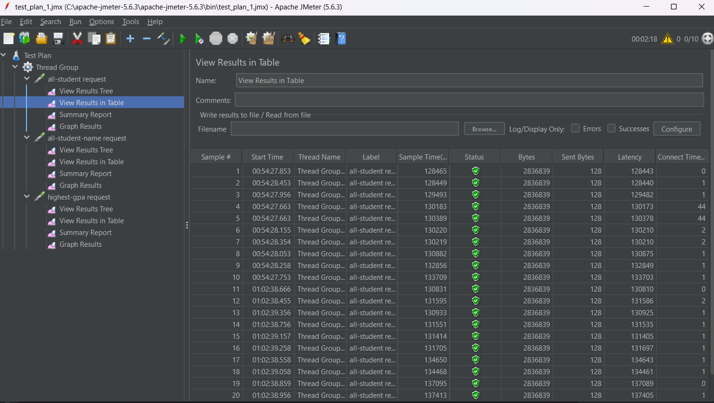
#### /all-student-name
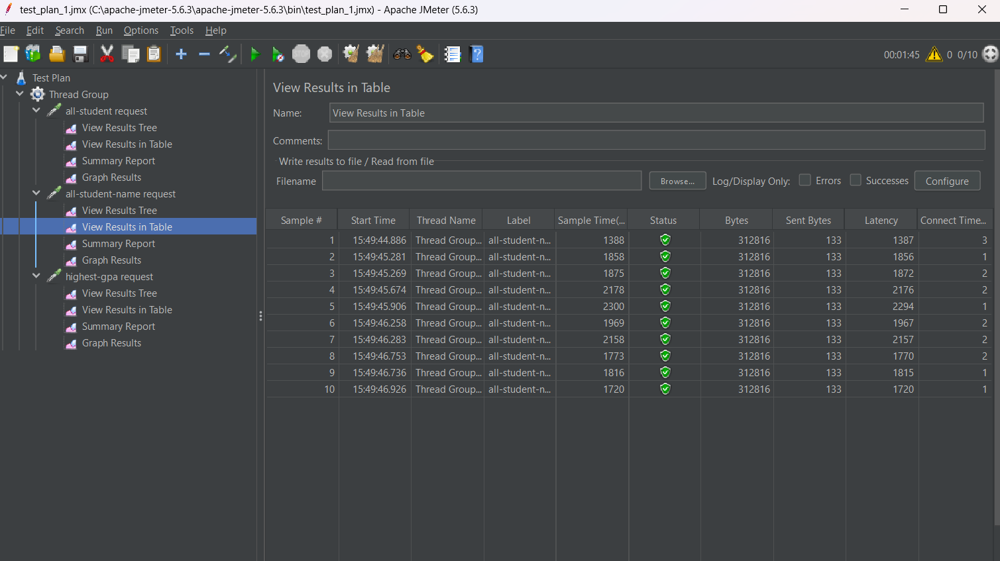
#### /highest-gpa
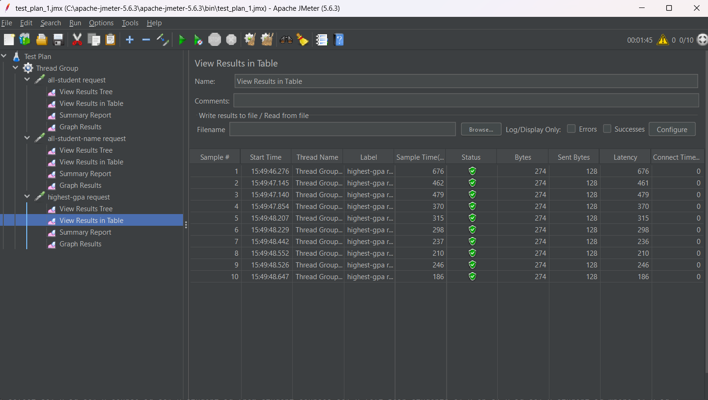

## Hasil JMeter CMD
#### /all-student
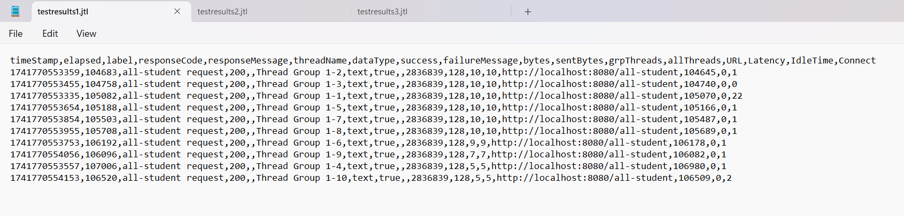
#### /all-student-name
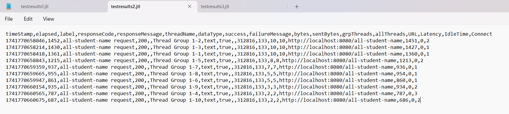
#### /highest-gpa
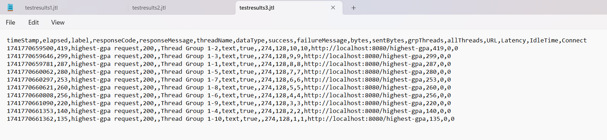

# After Profiling
## Hasil JMeter GUI
#### /all-student
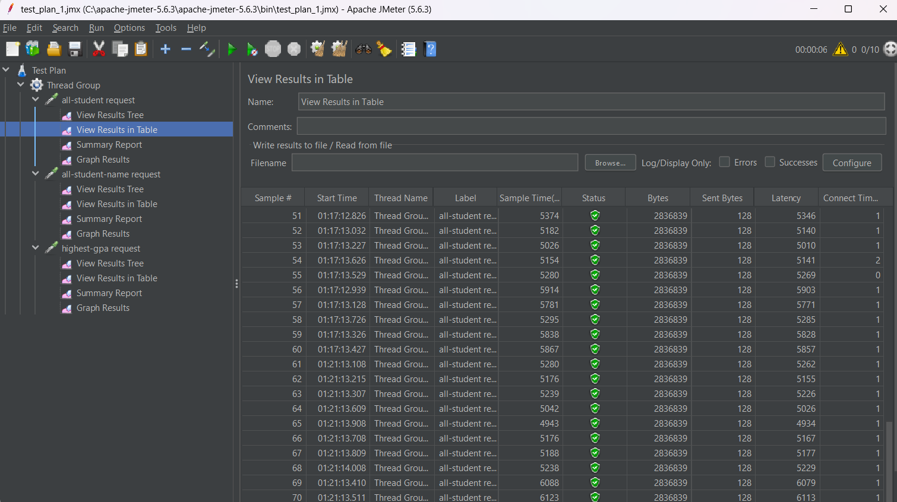
#### /all-student-name
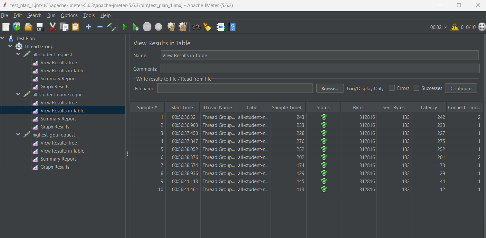
#### /highest-gpa
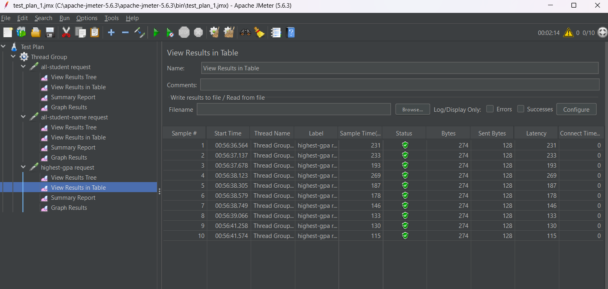

## Hasil JMeter CMD
#### /all-student
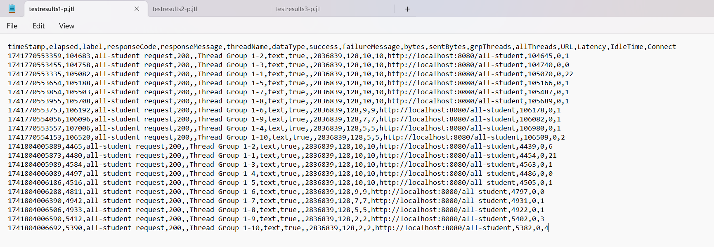
#### /all-student-name
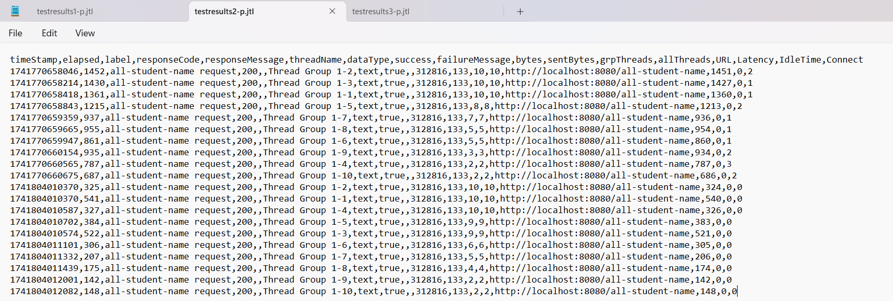
#### /highest-gpa
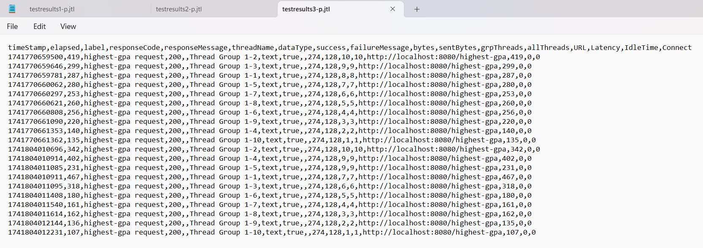

Kesimpulan:
Setelah dilakukan pengujian performa ulang dengan JMeter setelah melakukan profiling dan optimasi performa, hasil pengujian menunjukkan adanya peningkatan yang signifikan. Waktu respons yang lebih cepat, jumlah permintaan yang berhasil diproses dalam satu detik, dan pengurangan penggunaan sumber daya (CPU, memori) menjadi indikasi bahwa optimasi yang dilakukan telah berhasil. Dapat dilihat dari SS sebelum dan sesudah profiling dimana terlihat peningkatan performa kecepatan dengan jelas disana (setidaknya 20% lebih cepat). Dari hasil tersebut, dapat disimpulkan bahwa optimasi yang dilakukan memberikan dampak positif terhadap kinerja aplikasi. Peningkatan ini menunjukkan bahwa aplikasi sekarang lebih efisien dalam menangani beban yang ada. Serta penting untuk terus memantau performa aplikasi secara berkala dan melakukan penyesuaian lebih lanjut jika diperlukan, guna menjaga kinerja yang optimal dalam berbagai kondisi penggunaan.

### Refleksi
1. JMeter digunakan untuk performance testing dengan mensimulasikan beban pengguna (contoh: request HTTP) untuk mengukur respons aplikasi di bawah tekanan. Sementara IntelliJ Profiler berfokus pada profiling kode untuk menganalisis kinerja internal seperti penggunaan CPU, alokasi memori, atau method execution time. JMeter mengidentifikasi masalah skalabilitas, sedangkan Profiler membantu menemukan bottleneck di level kode.

2. Proses profiling membantu melihat secara rinci bagian kode yang menghabiskan sumber daya (CPU/memori) atau berjalan lambat. Misalnya, melalui CPU/memory sampling, kita bisa menemukan loop tidak efisien, alokasi objek berlebihan, atau query database yang bermasalah.

3. Iya, IntelliJ Profiler efektif karena menyediakan visualisasi data kinerja secara real-time (seperti call tree dan memory allocation tracking), yang memudahkan pelacakan bottleneck tanpa perlu alat eksternal. Integrasinya dengan IDE juga mempercepat proses analisis.

4. Tantangan utamanya adalah lingkungan testing yang tidak konsisten.Contohnya perbedaan spesifikasi hardware dan kompleksitas analisis data. Solusinya dengan menggunakan lingkungan terstandarisasi dan menggabungkan hasil JMeter (beban eksternal) dengan Profiler (analisis internal) untuk diagnosis menyeluruh.

5. Kemampuan analisis mendetail seperti memory leaks atau thread contention, dan antarmuka yang terintegrasi langsung dengan kode. Ini mempercepat identifikasi masalah tanpa konfigurasi rumit.

6. Jika hasil tidak konsisten, perlu dicek kembali skenario testing, misalnya beban di JMeter tidak sesuai dengan kondisi profiling. Solusinya dengan mereplikasi kondisi yang sama dan memvalidasi melalui kombinasi log aplikasi dan metrik tambahan.

7. Berdasarkan perubahan kode sebelumnya, strategi saya adalah
- Meminimalkan operasi berat seperti N+1 query dengan fetching data sekaligus.

- Menggunakan algoritma lebih efisien, contohnya stream processing untuk manipulasi data.

- Memastikan tidak ada regresi dengan melakukan unit testing ketat dan membandingkan hasil sebelum/sesudah optimasi.

- Monitoring setelah deployment untuk memverifikasi peningkatan kinerja tanpa mengganggu fungsionalitas.